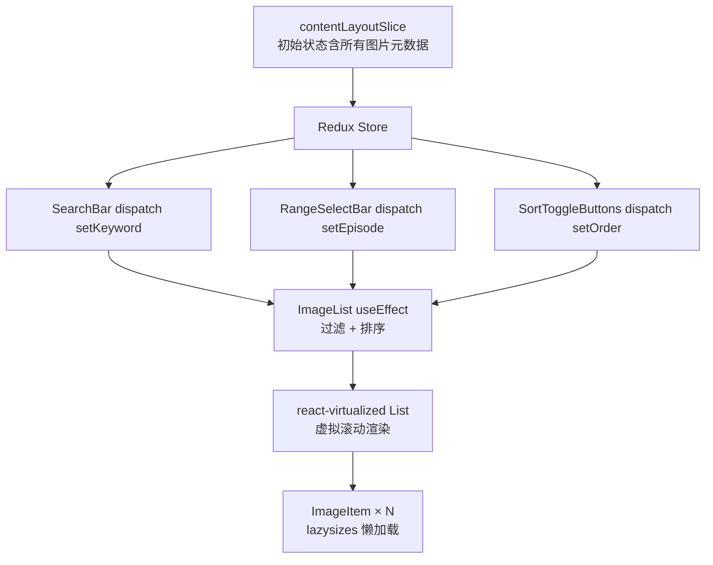

# Ave Mujica 截圖搜尋器 — 架构文档

## 概述

一个基于 **React 19 + TypeScript + Vite** 的单页应用，用于搜索《BanG Dream - Ave Mujica》和《BanG Dream - MyGO!!!!!》两部动画的台词截图、表情包和梗图。

- **在线地址**: https://ave-mujica-images.pages.dev/
- **部署**: GitHub Pages（通过 GitHub Actions 自动部署）
- **版本**: 1.1.13

## 技术栈

| 层面       | 技术                                         |
| ---------- | -------------------------------------------- |
| 框架       | React 19, TypeScript 6                       |
| 构建       | Vite 8                                       |
| 状态管理   | Redux Toolkit 2                              |
| UI 组件    | Material UI 9, react-virtualized 9           |
| 样式       | SCSS + MUI `sx` prop                         |
| 图片降级   | sharp 0.34（WebP → JPG 转换脚本）            |
| 懒加载     | lazysizes 5                                  |
| 虚拟滚动   | react-virtualized (List + WindowScroller)    |
| 部署       | GitHub Actions → gh-pages                    |
| 包管理     | pnpm（lock 文件）+ Bun（lock 文件，可选）    |

## 整体架构

```
App.tsx (ThemeProvider + 布局壳)
├── HeaderLayout          — Logo + 标语
├── ContentLayout         — 浏览器兼容性检测 + Notification + Dialog
│   └── HomePage
│       ├── SearchPanel        — 搜索区域
│       │   ├── SearchBar      — 关键词输入框（250ms debounce）
│       │   ├── RangeSelectBar — 集数筛选下拉
│       │   └── SortToggleButtons — 排序切换
│       ├── BaseTabs           — 切换标签（Ave Mujica / MyGO）
│       ├── ImageList          — 虚拟滚动图片列表
│       │   └── ImageItem      — 单张图片卡片（悬浮操作按钮）
│       └── ToTopButton        — 回到顶部浮动按钮
└── FooterLayout          — 版本号 + GitHub Star 按钮
```

## 数据流



数据全部存储在 Redux 的 `contentLayoutSlice` 中，包括：
- `aveMujicaImages` / `myGOImages`：所有图片的元数据数组（`{name, episode}`）
- `keyword`：当前搜索关键词
- `aveMujicaEpisode` / `myGOEpisode`：当前集数筛选（0 = 全部）
- `order`：排序方向（`oldest` / `newest`）
- `currentTab`：当前激活标签（`ave-mujica` / `mygo`）
- `searchResultNum`：各标签下的搜索结果数量

无后端、无 API 请求。所有数据在构建时静态注入。

## 图片资源结构

```
src/assets/
├── logo.png              # Header logo
├── black.webp             # 占位图（懒加载前显示）
├── ave_mujica_logo.png    # Tab 标签图标
├── mygo_logo.png          # Tab 标签图标
├── webp/
│   ├── ave-mujica/        # 1226 张 Ave Mujica 截图 (WebP)
│   └── mygo/              # 1166 张 MyGO 截图 (WebP)
└── jpg/
    ├── ave-mujica/        # JPG 版本（由 convertWebpToJpg.js 生成）
    └── mygo/
```

**命名规则**: `{台词}.webp`，与 `contentLayoutSlice` 中的 `name` 字段精确对应。文件名含重复台词时加 `_1`、`_2` 后缀。`[无词]` 前缀表示无台词纯表情截图。

WebP 用于页面展示（体积小），JPG 由 sharp 转换脚本生成，用于「下载 JPG 档」功能（兼容性更好）。

## 关键设计决策

### 1. 为什么影像数据写死在 Slice 而非 JSON 文件？

避免运行时 fetch 开销。构建时 Vite 将 TypeScript 文件一并打包，零网络请求，首屏即搜。

代价：`contentLayoutSlice.ts` 约 135KB（2491 行），新增图片需手动维护。

### 2. 为什么用 react-virtualized 而不是 CSS grid？

图片量超过 2000 张，全量 DOM 渲染会导致卡顿。react-virtualized 的 `WindowScroller + AutoSizer + CellMeasurer` 组合实现了：
- 仅渲染可视区域附近的图片行
- 自适应列数（1~4 列，随 viewport 宽度变化）
- 动态行高测量（CellMeasurerCache）

### 3. 为什么同时存 WebP 和 JPG？

- **WebP** 用于页面展示，压缩率高，加载快（配合 lazysizes 懒加载）
- **JPG** 用于下载功能，兼容所有平台（某些 APP 内置浏览器不支持 WebP 下载）

`convertWebpToJpg.js` 用 sharp 批量转换，跳过已存在的 JPG 文件。

### 4. Facebook/Line 浏览器检测

`ContentLayout` 在 mount 时检测 UA：
- **Facebook 内置浏览器**（`FBAN`/`FBAV`）：UI 兼容性差，弹窗建议换 Chrome/Safari
- **Line 内置浏览器**：图片下载失效，弹窗建议换浏览器

仅在移动端（宽度 < 768px）触发。

## 部署流程

```
push to main
  → GitHub Actions (deploy.yml)
    → pnpm install → build
    → peaceiris/actions-gh-pages
      → 产出部署到 gh-pages 分支
```

构建产物注入两个全局常量：
- `APP_VERSION`：来自 `package.json` version
- `BUILD_DATE`：构建日期（`YYYY-MM-DD`）

显示在页面底部的 Footer。

## 文件清单

```
src/
├── main.tsx                          # 入口：ReactDOM + Redux Provider
├── App.tsx                           # 根组件：ThemeProvider + 布局
├── type.ts                           # BaseImage 类型定义
├── layout/
│   ├── ContentLayout.tsx             # 浏览器检测 + 通知 + 对话框
│   ├── HeaderLayout.tsx              # 顶部 Logo + 标语
│   ├── FooterLayout.tsx              # 底部版本号 + GitHub Star
│   └── contentLayoutSlice.ts         # Redux Slice（含所有图片元数据）
├── pages/Home/
│   └── HomePage.tsx                  # 首页组装
├── components/
│   ├── common/
│   │   ├── BaseTabs.tsx              # Ave Mujica / MyGO 标签切换
│   │   ├── BaseDialog.tsx            # 通用对话框
│   │   └── NotificationAlert.tsx     # Snackbar 通知
│   ├── images/
│   │   ├── ImageList.tsx             # 虚拟滚动列表（核心组件）
│   │   ├── ImageItem.tsx             # 单张图片卡片
│   │   ├── ImageIconButton.tsx       # 悬浮操作按钮
│   │   ├── TabImage.tsx              # 标签图标
│   │   └── ToTopButton.tsx           # 回到顶部
│   └── search/
│       ├── SearchPanel.tsx           # 搜索面板容器
│       ├── SearchBar.tsx             # 关键词输入（debounce 250ms）
│       ├── RangeSelectBar.tsx        # 集数选择下拉
│       └── SortToggleButtons.tsx     # 排序按钮
├── store/
│   └── store.ts                      # Redux Store 配置
└── styles/                           # SCSS 样式文件
convertWebpToJpg.js                   # WebP → JPG 批量转换工具
```

## 扩展指南

### 添加新图片

1. 截图放入 `src/assets/webp/{ave-mujica|mygo}/`
2. 在 `contentLayoutSlice.ts` 的对应数组添加 `{ name, episode }`
3. 运行 `pnpm convert-images` 生成 JPG 版本
4. 提交 PR

### 添加新番剧系列

1. 在 `contentLayoutSlice.ts` 的 `initialState` 中添加新的图片数组
2. 添加对应的 tab 选项到 `BaseTabs.tsx`
3. 在 `assets/webp/` 和 `assets/jpg/` 下创建新目录
4. 更新 `ImageList.tsx` 中的过滤逻辑、`RangeSelectBar.tsx` 中的集数列表
5. 更新 `convertWebpToJpg.js` 适配新目录
